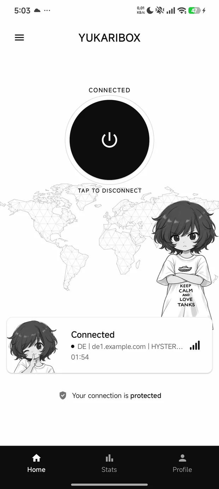
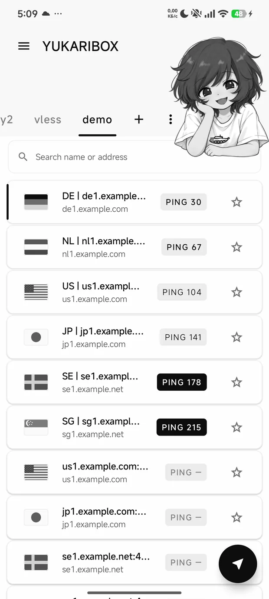
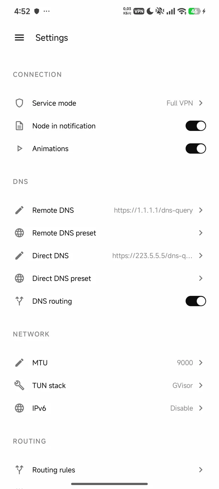

# YukariBox

**Your traffic, your rules.** A sing-box client for Android. Nine protocols, subscriptions,
per-app routing, and a kill switch that cannot be turned off.

YukariBox drives a prebuilt [sing-box](https://sing-box.sagernet.org/) core behind a Jetpack
Compose interface: paste a share link or a subscription URL, pick a server, press the circle.
It writes the core's configuration for you, watches the session for as long as it runs, and
stops carrying traffic rather than letting it out the ordinary way when the tunnel breaks. It
has no server of its own, no account and no update check — your servers, their credentials and
anything it ever records live in the app's private storage on your phone and go nowhere else.

**[Download the APK](https://tuftatech.github.io/)** ·
[Documentation](https://tuftatech.github.io/help.html) ·
[Latest release](https://github.com/TuftaTech/YukariBox/releases/latest)

arm64-v8a · Android 9 or newer

## Screenshots

| Home | Servers | Settings |
|:---:|:---:|:---:|
|  |  |  |

## Why you would want this one

### If the connection drops, nothing leaks out

The dangerous moment for a VPN is the moment it breaks: that is when traffic tends to fall back to
the ordinary network without anyone being told. Here it simply stops. Nothing goes anywhere until
you decide what to do — and there is no switch to turn that off, so it cannot be off by accident. It
is also honest about half-cover: when only some of your apps are going through the tunnel, it says
so instead of showing a reassuring green light.

### It keeps no diary about you

Out of the box nothing is written down at all: not which servers you use, not when you connected,
not a single line. A log is a tool for fixing a problem, so you switch it on when you have one — and
switching it back off erases what it wrote. Whatever it records stays on your phone.

### There is nobody for it to report to

This app has no server of its own, so there is nothing for it to phone. It reaches exactly four
things, and all four are yours: your subscription link, your DNS server, the address it pings to
check the connection works, and the server you chose. No analytics, no anonymous statistics, no
update check — and nothing in it that could send them even if someone wanted to.

### Your passwords are treated like passwords

Server passwords never pass through anywhere another app, or a bug report, could read them along the
way. And your server list survives a bad moment: every save is written so that a crash or a flat
battery halfway through leaves the previous version whole rather than an empty file. That is not
hypothetical — one interrupted write is exactly how a whole saved list was lost once.

### It notices when a server quietly dies

A connection can look perfectly alive long after it has stopped carrying anything: the server got
blocked, or overloaded, or simply went away. This app watches the live connection rather than only
the moment you pressed connect — when the traffic goes silent it checks, and rebuilds the connection
if the server really is gone.

### Nothing here has to be taken on trust

The source is open and small enough that a person can actually read it — one module, no hidden
machinery. Every library it uses is pinned by checksum, so none of them can be swapped out
underneath it. And the build is deliberately repeatable: with the same toolchain, anyone can rebuild
the app and compare it with the file published here.

## Protocols

Nine protocols are parsed from share links: VLESS, VMess, Trojan, Shadowsocks, Hysteria2,
TUIC, WireGuard, SOCKS and HTTP. Shadowsocks is restricted to AEAD ciphers on purpose, and a
link whose `security` value is unrecognised resolves to TLS rather than to nothing — an
unreadable link fails secure, not plaintext.

A subscription is fetched over http or https with every redirect re-validated, decoded from
base64 or plain text, and folded into a group that keeps your favourites across a refresh and
tells you when the server you had selected has moved. Links go back out the way they came in,
as text or as a QR code, and a full backup can be written through the system file picker,
encrypted with a password if you ask for one.

## Requirements

arm64-v8a and Android 9 (API 28) or newer. The core ships as a prebuilt native library for one
architecture; the others are not published rather than published untested. One universal APK,
no splits.

## Building

`JAVA_HOME` must point at a JDK 21. The Android SDK path comes from `local.properties`, which
is not in the repository — point `sdk.dir` at your own installation.

```bash
./gradlew assembleDebug          # debug APK, installs alongside as dev.yukaribox.vpn.debug
./gradlew testDebugUnitTest      # JVM unit tests over the pure layers (JUnit 4)
./gradlew lintDebug              # Android Lint, abortOnError
./gradlew detekt                 # static analysis, baseline-gated
./gradlew assembleRelease        # R8 and resource shrink
```

Those first four are the definition of done for any change here; all four are green on every
commit. A release build is signed only when a keystore is supplied out of band — four
`yukaribox.keystore.*` keys in `local.properties`, or the matching `YUKARIBOX_KEYSTORE_*` /
`YUKARIBOX_KEY_*` environment variables — and stays unsigned otherwise, so a build on a
machine without the key cannot quietly produce something that looks published.

The build is meant to be repeatable. Every dependency is pinned by checksum in
`gradle/verification-metadata.xml`, the Gradle wrapper by `distributionSha256Sum`, and the
prebuilt core is committed as `app/libs/libcore.aar`, so a substituted artifact fails the build
instead of entering it. AGP's dependency-metadata block, which is signed per build
environment, is dropped from the APK; the same source and the same toolchain give the same
file, which is what makes comparing your own build against the published one worth doing.

## Verifying what you downloaded

Two questions, and they are answered from two different places: the checksum says the file
arrived intact, the signature says who built it.

```bash
sha256sum YukariBox-arm64.apk                        # against the sum beside the download button
apksigner verify --print-certs YukariBox-arm64.apk   # against the fingerprint below
```

Every release is signed with the same key, and this is its certificate:

```
certificate SHA-256 digest: ae13a577b920c35c2fd3a92804809df3c159b511e82e5ed27e90c0b032f99ce1
certificate SHA-1 digest:   d1d66273acbd48ba7be6c0213c9478ec486d9968
certificate DN:             CN=YukariBox, O=TuftaTech
```

That is the form `apksigner` prints; `keytool -list` prints the same bytes upper-case and
colon-separated. The APK's own SHA-256 changes per release, so it lives with the release
instead: beside the download button, and in `YukariBox-arm64.apk.sha256` next to the file. A
number written in two places is a number that goes stale in one of them.

## Licence

GPL-3.0-or-later, because it links the GPL-licensed sing-box core. The full text is in
[`LICENSE`](LICENSE), and it is the reason that file stays in the tree. You may use, study,
change and redistribute the app under those terms.

Third-party notices: sing-box (GPL-3.0-or-later), ZXing (Apache-2.0) for QR codes, Material
Symbols (Apache-2.0) for the icon outlines, AndroidX and Jetpack Compose (Apache-2.0), and
kotlinx.serialization (Apache-2.0). The world map is computed from public-domain Natural Earth
coastline data.

The artwork is the author's own drawing of Yukari Akiyama, a character belonging to the rights
holders of Girls und Panzer; she appears here in a non-commercial fan project, without their
endorsement. [Licences, privacy and permissions](https://tuftatech.github.io/legal.html) is the
full statement, including the seven permissions the app asks for and what each one is used for.
